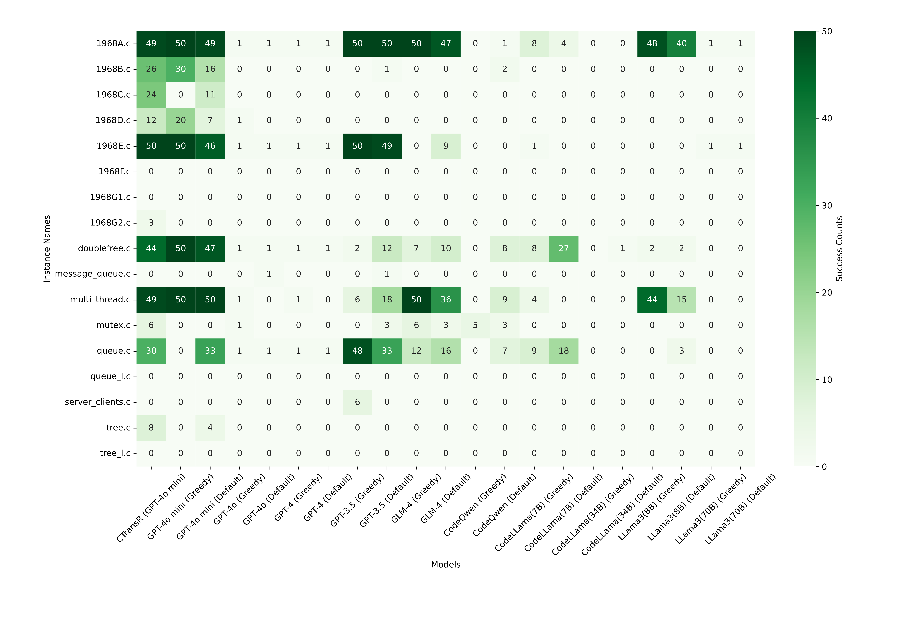
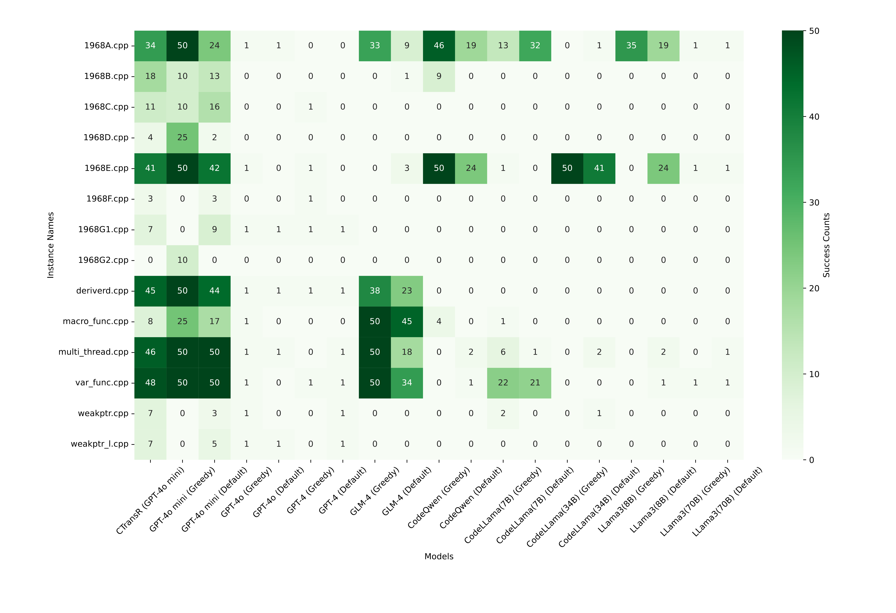

# CTransR: Automated Code Translation from C/C++ to Rust

## Overview

CTransR is an automated approach for translating code from C/C++ to Rust. The method combines self-prompt engineering with a genetic algorithm to guide a large language model (LLM) in generating Rust code from given C/C++ instances. The translation process is designed to maintain the same I/O functionality as the original C/C++ code.

## Installation and Dependencies
```bash
httpx               # For making asynchronous HTTP requests
zhipuai             # For interacting with the ZhipuAI API
requests            # For making HTTP requests and handling exceptions
openai              # For interacting with the OpenAI API
```

- build
```bash
pip install -r requirements.txt
curl --proto '=https' --tlsv1.2 -sSf https://sh.rustup.rs | sh
```

## Run

- Add Your API Keys:
    
    Locate the `CTransR/api` directory in your project.
    Add your API keys in the appropriate files within this directory. Each API key should be placed in the corresponding file, depending on which service it is for (e.g., ZhipuAI, OpenAI, etc.).
- Install Python Dependencies
    ```
    pip install -r requirements.txt
    ```
- Install Rust and Cargo
    1. Install Rust and Cargo:

        If Rust and Cargo are not already installed, you can install them using rustup:
        ```bash
        curl --proto '=https' --tlsv1.2 -sSf https://sh.rustup.rs | sh
        ```
    2. Verify the installation:

        After installation, verify that Rust and Cargo are correctly installed:
        ```bash
        rustc --version
        cargo --version
        ```
- Run the Genetic Algorithm with Self-prompt
    ```bash
    cd CTransR/ga
    # we run CTransR with GPT4o mini as an example. 
    ./miniga.sh 
    ```
- Run your own data
    ```bash
    # add your code into CTransR/dataset
    # assume the CTransR is under the usr_dir
    # e.g.:
    cd CTransR/dataset
    mkdir test
    cd test
    mkdir code
    mkdir testcase
    mkdir testcase/your_code_name
    mkdir testcase/your_code_name/input
    mkdir testcase/your_code_name/output
    cd ~
    cp your_code.c ~/CTransR/dataset/test/code
    cp your_input_1 ~/CTransR/dataset/test/testcase/your_code_name/input_1
    cp your_oricle_output_1 ~/CTransR/dataset/test/testcase/your_code_name/output_1
    ...
    cd ~/CTransR/ga
    # GPT4o mini as an example
    python mini_ga.py ../dataset/test/code/your_code_name.c ../dataset/test/testcase/your_code_name/ your_code_name your_code_name_success
    python rename.py your_code_name
    ```


## Dataset EvalC2R
EvalC2R is a benchmark dataset specifically constructed to evaluate the effectiveness of automated code translation from C/C++ to Rust. The dataset includes a variety of C/C++ code instances drawn from real-world scenarios, particularly focusing on the challenging aspects of code translation.

The EvalC2R dataset consists of 31 C/C++ code instances collected from two primary sources:

    Codeforces Online Judge:
        Contest ID: 1968
        Number of Instances: 16
        These instances include competitive programming problems that require careful handling of memory management and I/O operations, making them ideal for testing the robustness of translation approaches.

    AtomGit C to Rust Translation Competition:
        Number of Instances: 15
        These instances are derived from real-world systems where C and C++ codebases are being migrated to Rust. The problems include translating pointer-based memory management to Rust’s ownership model and converting C++ class hierarchies to Rust’s trait system.

|Language|Data Source|Code lines|Number of Instances|
|:---:|:---:|:---:|:---:|
|C|Codeforce|<=50|5|
| | |<=100|3|
| | |>100|0|
| |Atomgit|<=50|2|
| | |<=100|3|
| | |>100|4|
|CPP|Codeforce|<=50|6|
| | |<=100|2|
| | |>100|0|
| |Atomgit|<=50|1|
| | |<=100|5|
| | |>100|0|







